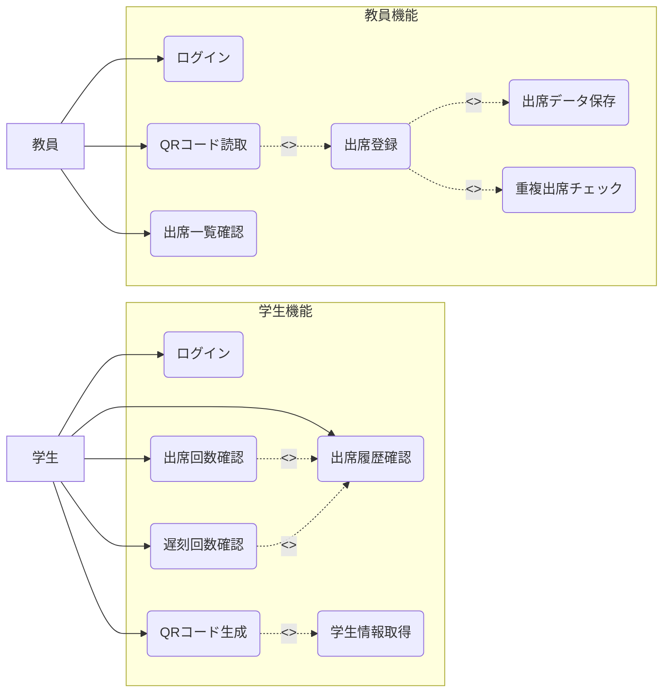
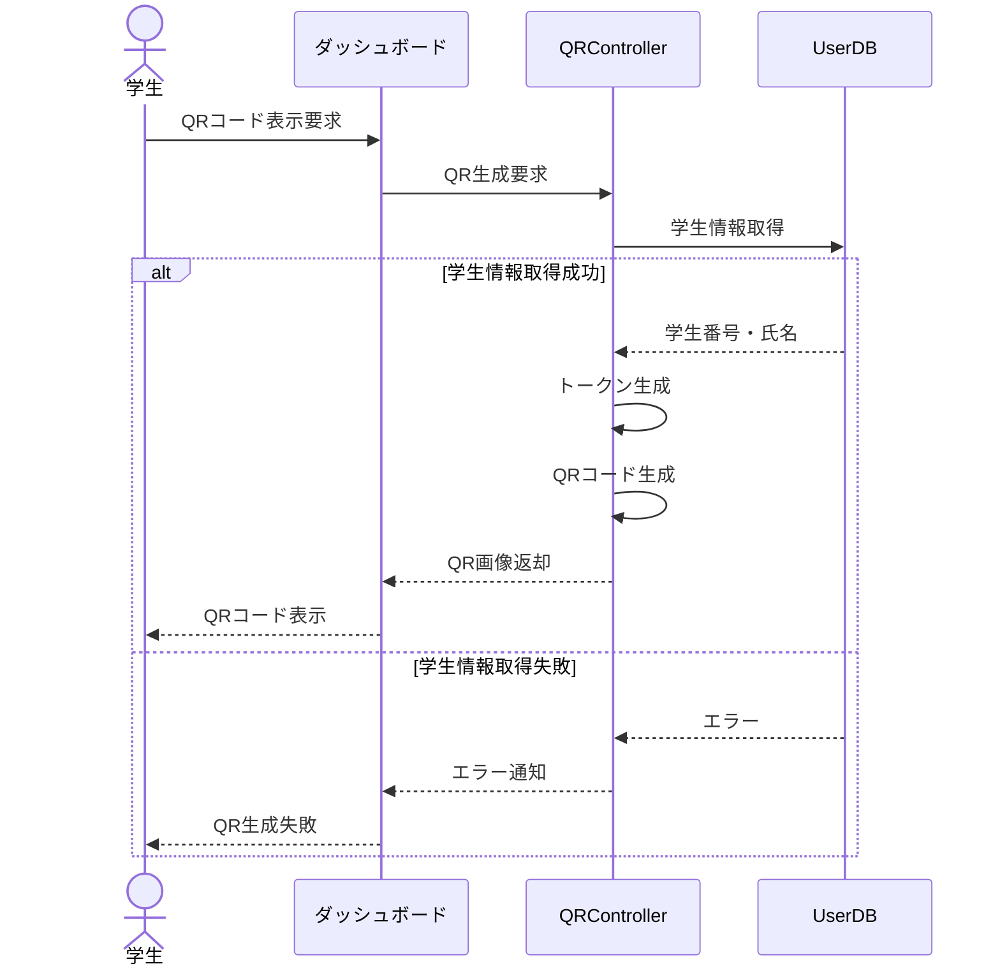
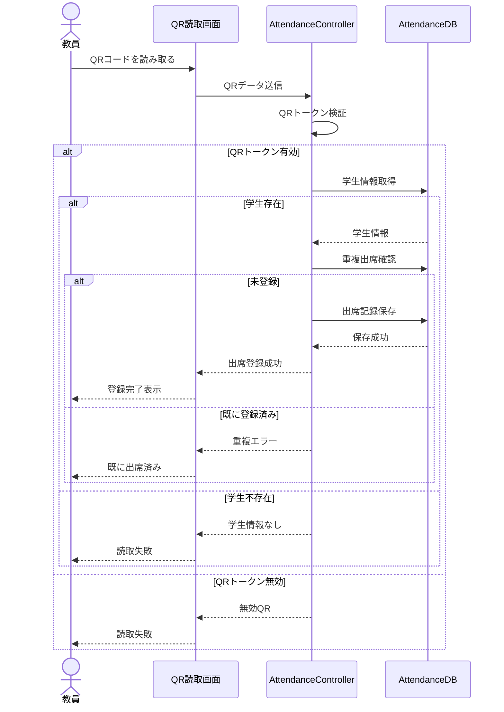
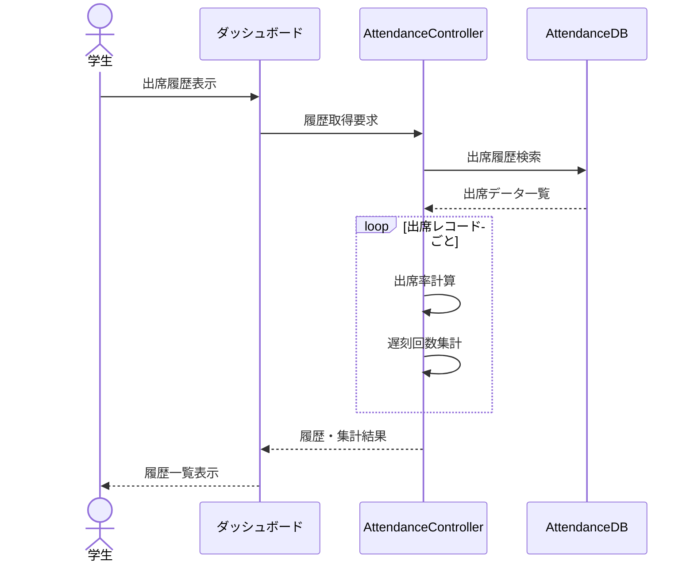
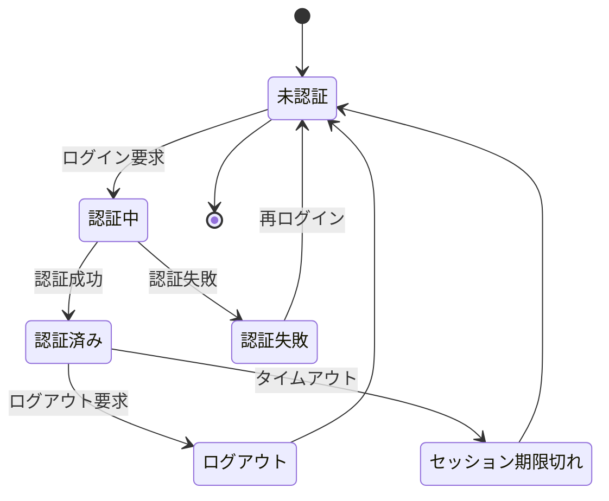
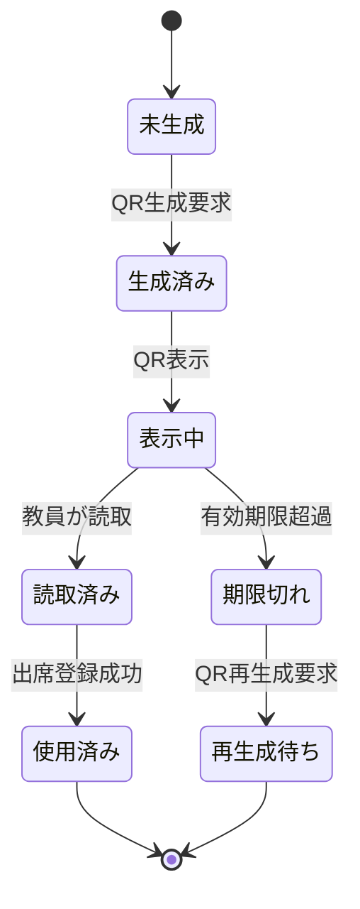
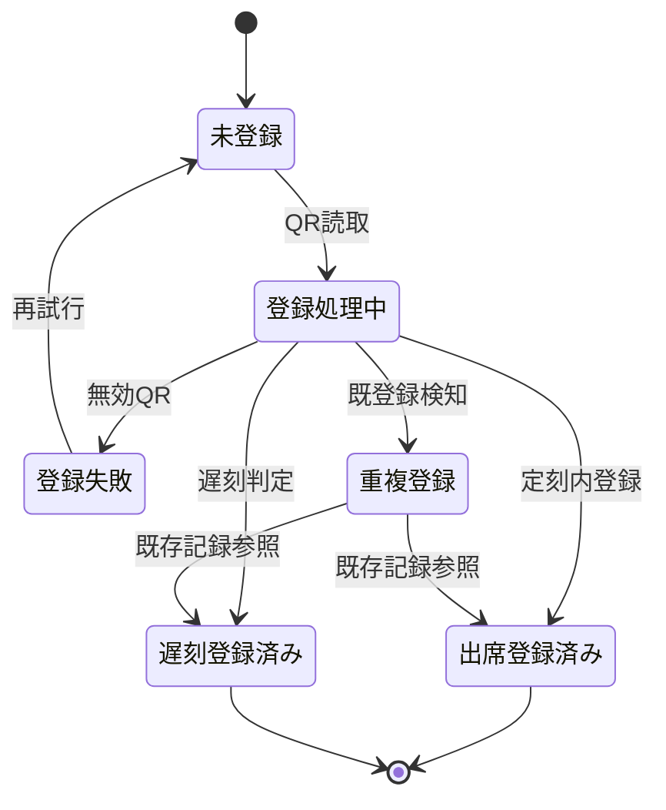
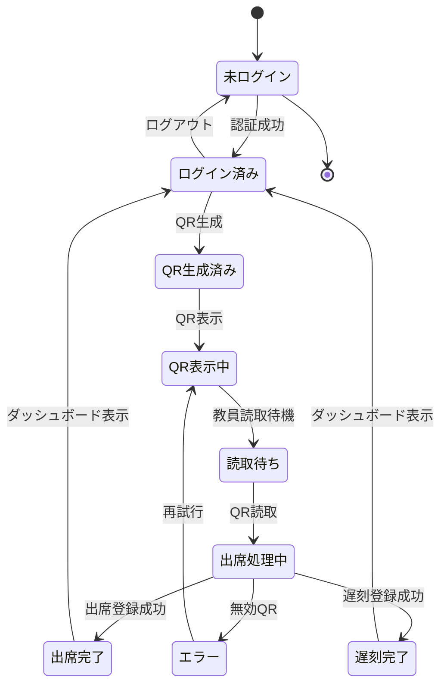

ユースケース


クラス図
```mermaid
classDiagram
    class User {
        <<abstract>>
        +int id
        +string email
        +string passwordHash
        +datetime createdAt
        +login()
        +logout()
    }

    class Student {
        +string studentNumber
        +string name
        +generateQRCode()
        +viewAttendanceHistory()
        +getAttendanceCount()
        +getLateCount()
    }

    class Teacher {
        +string name
        +scanQRCode()
        +viewAttendanceList()
    }

    class QRCode {
        +int id
        +string token
        +datetime issuedAt
        +datetime expiresAt
        +generate()
        +validate()
    }

    class Attendance {
        +int id
        +datetime attendanceTime
        +AttendanceStatus status
        +record()
        +isDuplicate()
    }

    class AttendanceService {
        +registerAttendance()
        +checkDuplicate()
        +getAttendanceHistory()
        +calculateAttendanceCount()
        +calculateLateCount()
    }

    class AuthService {
        +loginWithGoogle()
        +loginWithEmail()
        +validateUser()
    }

    class AttendanceStatus {
        <<enumeration>>
        PRESENT
        LATE
    }

    User <|-- Student
    User <|-- Teacher

    Student "1" *-- "1" QRCode : owns
    Student "1" -- "0..*" Attendance : has

    Teacher "1" --> "0..*" Attendance : manages

    Attendance --> AttendanceStatus

    AttendanceService ..> Attendance : uses
    AttendanceService ..> Student : uses

    AuthService ..> User : authenticates
 ```
シーケンス図


学生ログイン
```mermaid
sequenceDiagram
actor Student as 学生
participant UI as ログイン画面
participant Controller as AuthController
participant DB as UserDB

Student->>UI: メールアドレス入力
UI->>Controller: ログイン要求

Controller->>DB: ユーザー検索(email)

alt ユーザー存在
    DB-->>Controller: ユーザー情報
    Controller-->>UI: ログイン成功
    UI-->>Student: ダッシュボード表示
else ユーザー未登録
    DB-->>Controller: 該当なし
    Controller-->>UI: エラー
    UI-->>Student: ログイン失敗表示
end
```


QRコード生成



出席登録


出席履歴確認


状態遷移図


学生セッション



QRコード


出席記録



出席



# テスト結果報告書
## プロジェクト情報
- アプリ名: [QR出席]
- 氏名またはチーム名: [明坂青空]
- テスト実施日: [2026/7/8]
- テスト対象: [ログイン、画面、APIなど]

|#|テスト対象|テスト観点(正常/境界/異常)|テスト条件|テスト手順(1行)|期待値(1行)|結果(○/×)|
|1|index.php|正常|許可されたドメインでのログイン|@g.nihon-u.ac.jp のGoogleアカウントを選択してログインする|認証に成功し、student.php 画面に遷移する|〇|
|2|index.php|異常|許可外ドメインでのログイン|@gmail.com 等の許可されていないアカウントを選択してログインする|index.php に戻り「指定された組織のGoogleアカウント以外は...」と表示される|〇|
|3|callback.php|異常|認証コードなしでの直接アクセス|ブラウザのURLバーに直接 callback.php を入力してアクセスする|index.php に戻り「ログイン中にエラーが発生しました（コード: missing_code）」と表示される|〇|
|4|student.php|異常|未ログイン状態でのアクセス|シークレットウィンドウを開き|直接 student.php にアクセスする|index.php に戻り「ログイン中にエラーが発生しました（コード: unauthorized_access）」と表示される|〇|
|5|index.php|正常|ログイン済み状態でのアクセス|student.php 表示後に、URLバーに index.php と入力してアクセスする|自動的に student.php へリダイレクトされる|〇|
|6|index.php|異常|未定義のエラーパラメータ付きアクセス|URLバーに index.php?error=unknown_error と入力してアクセスする|画面に「ログイン中にエラーが発生しました（コード: unknown_error）」と表示される|〇|
|7|callback.php|異常|Google認証画面でのアクセス拒否|ログイン時のGoogleの同意画面でキャンセル（または戻る）を行う|index.php に戻り、エラーメッセージが表示される|〇|
|8|callback.php|境界|短い文字数の学籍番号の抽出|メールのローカルパートが1文字（例:a@g.nihon-u.ac.jp）のアカウントでログインする|学籍番号として「a」が正しく抽出され、画面に表示される|〇|
|9|student.php|正常|学生情報の正しい画面表示|ログイン後の student.php の表部分を確認する|自身の学籍番号、氏名、メールアドレスが正しく表示されている|〇|
|10|student.php|正常|QRコードの正常な描画|student.php の画面中央の点線枠内を確認する|学籍番号のデータが埋め込まれたQRコード画像が描画されている|〇|
|11|student.php|境界|学籍番号が空の状態|セッションまたはDBの学籍番号を空にした状態で student.php を表示する|「学籍番号が取得できなかったため、QRコードを生成できません。」と表示され、QR枠が出ない|〇|
|12|student.php|異常|プロフィール名にHTMLタグが含まれる場合|Googleアカウントの名前を <script>alert(1)</script> に変更してログインする|スクリプトは実行されず、文字としてそのままエスケープ表示される|〇|
|13|student.php|境界|極端に長い氏名やメールアドレスの表示|長い文字列の氏名が登録されたアカウントでログインする|表のレイアウトが大きく崩れることなく|折り返される等で適切に表示される|〇|
|14|teacher.php|正常|スキャナー起動とカメラの許可|teacher.php にアクセスし、ブラウザのカメラ許可ダイアログで「許可」を押す|カメラの映像が画面の枠内にリアルタイムで表示される|〇|
|15|teacher.php|異常|カメラの拒否|teacher.php にアクセスし、ブラウザのカメラ許可ダイアログで「ブロック」を押す|映像は表示されないが、アプリ全体がクラッシュすることなく待機状態になる|〇|
|16|teacher.php|正常|正常なQRコードの読み取り|学生用画面に表示されたQRコードを教員用カメラにかざす|枠が緑色になり「（学籍番号）の出席を受け付けました！」と表示される|〇|
|17|teacher.php|境界|同一QRコードの連続スキャン（通信中）|QRを読み取り「通信中...」と表示されている間に、全く同じQRコードを動かしながらかざし続ける|連続して通信が発生せず、1回分の処理だけが行われる|〇|
|18|teacher.php|境界|別QRコードの連続スキャン（通信中）|1つ目のQRを読み取り「通信中...」の表示中に、すかさず別の学生のQRコードをかざす|処理中フラグによりブロックされ、2つ目のQRの通信は発生しない|〇|
|19|teacher.php|異常|同一学生の二重登録（3秒経過後）|1回目の読み取り成功から3秒以上経過し画面がリセットされた後、同じQRを再度かざす|枠が赤色になり「すでに本日の出席が登録されています。」と表示される|〇|
|20|teacher.php|正常|別の学生の連続読み取り（3秒経過後）|1人目の読み取り成功から3秒以上経過した後、別の学生のQRをかざす|枠が緑色になり2人目の学生の出席も正常に受け付けられる|〇|
|21|teacher.php|異常|スキャン後の通信エラー（オフライン）|teacher.php 表示後に端末を機内モードにし、QRコードをかざす|枠が赤色になり「通信に失敗しました。」と表示され、クラッシュしない|〇|
|22|record_attendance.php|異常|GETメソッドでの不正アクセス|ブラウザのURLバーに直接 record_attendance.php を入力してアクセスする"画面に {""status"":""error"",""message"":""不正なアクセスです。""} のJSONが表示される"|〇|
|23|record_attendance.php|異常|学籍番号が空のPOSTリクエスト|開発者ツール等を使用し、student_id を空にしてPOST送信する|"{""status"":""error"",""message"":""学籍番号が読み取れませんでした。""} のJSONが返る"|〇|
|24|record_attendance.php|異常|SQLインジェクションを狙った入力|student_id に ' OR 1=1 -- のような文字列を入れてPOST送信する,DBエラーや不正ログインは起きず、そのままの文字列として安全に処理（またはエラー）される|〇|

## サマリー
- 合計: 24件
- 合格: [24]
- 不合格:[0]
- 通過率: [100%]
